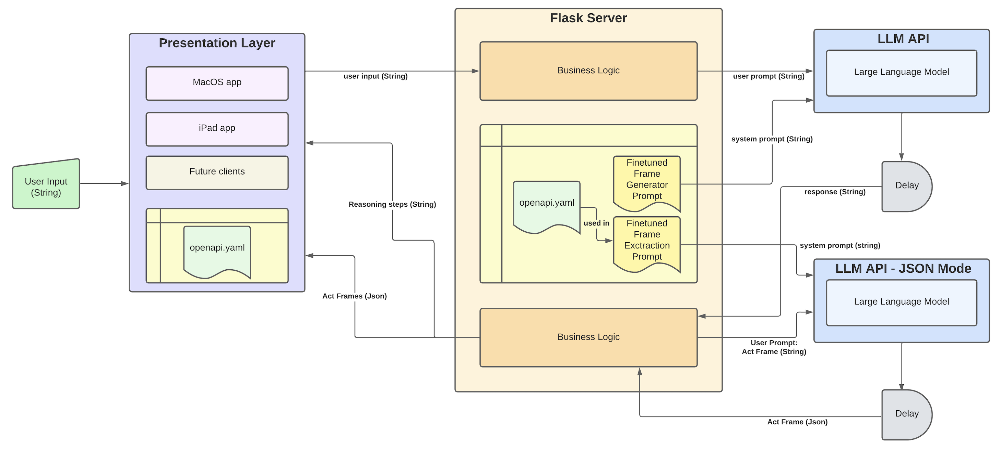
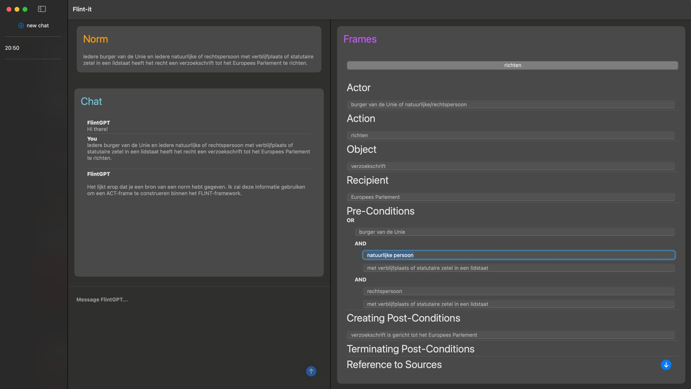

# Flint-It
Flint-it is the front-end layer of the Flint-it application prototype. It can be used together with the [FLINT-conversation-service backend](https://github.com/JuliusHuizing/FLINT-conversation-service) to function as a working prototype, or together with existing and future backends that implement the OpenAPI specification defined in the openapi.yaml file.

## Functionality

Ultimately, Flint-it aims to help legal experts construct FLINT representations of norms
more quickly and easily. To this end, Flint-it implements three high-level requirements. Namely, with Flint-it, a user can:

- Insert a norm and quickly obtain
an initial FLINT representation for that norm.
- Iterate on the initial interpre-
tation of the norm to achieve a FLINT inter-
pretation with which they are satisfied.
- Export the final FLINT inter-
pretation of the norm in a standardized format (json) for use in other downstream tasks.

## Limitations
Flint-it currently only provides a MacOS front-end, implemented in SwiftUI. Additional front-ends can be implemented in accordanc witht the provided OpenAPI specification and can be placed under *./clients/*.

